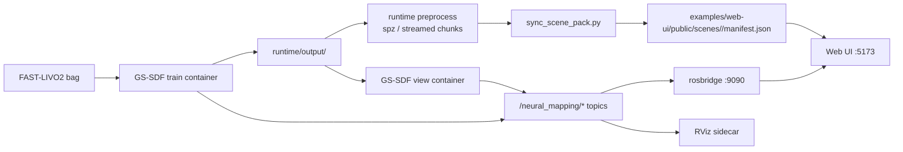

# GS-SDF Live / GS Console

这份仓库把现成的 `hku-mars/GS-SDF` 训练/回看运行时，包装成一套可以实际操作的工作流，目标是：

- 用 FAST-LIVO2 数据跑 GS-SDF
- 把 GS-SDF 输出同步成 Web UI 可消费的 scene pack
- 提供一个 `Live / GS` 双模式的浏览器控制台
- 通过 `rosbridge` 把 ROS 话题桥接到浏览器
- 保留 RViz 作为 sidecar / 对照工具

当前这份 README 不是论文式说明，而是面向“这台机器、这份工作区、当前已实现进度”的完整操作手册。

## 1. 当前进度

截至当前工作区，这些能力已经落地：

- `FAST-LIVO2 bag -> GS-SDF train` 已跑通
- `saved output -> GS-SDF view mode` 已跑通
- `rosbridge -> browser` 已跑通
- `React + Three.js + Spark` Web UI 已可启动
- `Live / GS` 双模式切换已实现
- `Playback / Live / GS` 三模式工作台已实现
- `FAST-LIVO2 sidecar playback stack` 已实现，浏览器优先消费：
  `/fastlivo/current_scan_world`、`/fastlivo/global_map`
- `Playback cache` 已实现，并已在当前工作区生成完整 cache
- `TopDown mini-map`、goal click、轨迹/位姿叠加已实现
- `2D Goal -> local A* path preview` 已实现，并同步显示到 2D / 3D
- `TopDown mini-map` 已支持地图编辑：
  `Obstacle`、`Erase`、`Save PGM`
- 地图编辑后的 occupancy grid 会直接参与本地规划
- `Navigation preview` 已实现，可沿 `plannedPath` 做前端运动学预演
- `RGB / Depth` 小窗已接入
- `Playback RGB` 已切到内置 `MJPEG/JPEG` stream
- `gs.ply -> spz` 预处理已实现
- `gs.ply -> streamed chunked spz` 预处理已实现
- `manifest` 已支持 `gs-chunks`
- Web UI 已支持 `Balanced / Quality` 两档 Gaussian source 切换
- `GS` 模式已支持 `Orbit / FPS` 两种控制
- `GS FPS` 的 `A / D` 横移方向已修正
- `Live` 模式在没有实时点云时，已支持 occupancy 点云回退显示
- `SDF mesh` 已支持优先使用顶点色；无色 occupancy 几何会走伪彩 fallback

当前仍然存在的限制：

- `saved view` 模式下，`/neural_mapping/pointcloud` 不会持续发布，所以 `Live` 视图里的点云通常是静态 fallback，不是真正 live ROS 点云
- 浏览器里的 `GS` 视觉效果不等于 GS-SDF 后端 `RGB` 渲染结果
- 浏览器端 `GS` 仍然会卡，根因是 splat 数量和 chunk 体量仍然很大
- `Navigation preview` 是前端运动学预演，不是 Gazebo / Nav2 物理仿真
- `Playback RGB` 的顺滑程度仍受 `/origin_img` 原始帧率约束，`32x` 不等于 `32x` 视觉帧率
- `as_occ_prior.ply` 本身没有 RGB，所以 occupancy cloud 不会天然变成彩色重建
- 现在的 Web UI 适合验证流程和交互，不适合把它误判成“已经完全替代 GS-SDF 官方渲染器”

### 1.1 按最初目标对照的完成度

最初的目标可以概括成两步：

1. 做一个承担 RViz 主要职责的 `Live Mapping + Tracking` 工作界面
2. 在同一套界面里提供一个可切换的 `GS Layer`，支持沉浸式浏览、拖拽、缩放和后续导航/编辑

按这个目标来对照，当前状态如下。

已经实现：

- `FAST-LIVO2` 对齐后的输入数据可以进入 `GS-SDF`
- `GS-SDF` 的训练结果和 saved view 结果都可以被当前工作流复用
- 浏览器端已经有 `Live / GS` 模式切换按钮
- `Live` 主视图已经支持轨迹、机器人、点云/几何图层、拖拽平移、滚轮缩放
- `Playback` 模式已经支持直接消费 FAST-LIVO2 raw playback topics：
  `/aft_mapped_to_init`、`/cloud_registered_body`、`/origin_img`
- `GS` 主视图已经支持 gaussian 图层加载
- `GS` 模式已经支持 `Orbit` 和 `FPS` 两种控制，不再强制只用 `WASD`
- 右侧 `TopDown Mini Map` 已支持 2D 拖拽、缩放、点击发布 `/move_base_simple/goal`
- 在没有完整导航仿真的情况下，UI 现在也会基于 occupancy grid 直接生成本地 `A*` 路径预览
- mini-map 现在已经支持直接编辑 occupancy map：
  画障碍、擦噪声、导出 `PGM`
- `Playback` 现在已经同时支持：
  - direct / sidecar playback
  - cached playback
- cached playback 已支持真实 timeline seek，不需要每次重新扫 bag
- UI 现在已经支持沿规划路径做导航预演，2D/3D 同步显示
- `RGB / Depth` 小窗已经接入
- 高斯文件已经有专门的运行时预处理和 chunked streaming 方案
- RViz sidecar 仍然保留，可以作为对照和保底工具

部分实现：

- `Live` 模式已经有“像 RViz 一样的工作流骨架”，但在 saved view 路线下，多数时候显示的是静态 fallback 点云，而不是持续刷新的 live ROS 点云
- “高斯和点云融合” 目前是图层叠加级别，适合看，不适合把它理解成完整成熟的融合渲染
- “点云投到地面形成 2D 地图” 已经有占据投影、局部编辑、导出 `PGM`，但还没有完整 map server / `yaml` 保存后端
- “测导航” 当前已经做到 goal 点击、A* path preview、前端导航预演，但还不是完整闭环导航仿真
- 现在已经支持 RViz 风格的 `2D Goal -> Path Preview`，但这个 path 默认来自本地 planner，不等同于真实 ROS planner 输出
- “拖页功能” 和 “zoom in 到一个地方” 已实现基础版，但交互手感和性能还没有到产品化程度

还没实现：

- 语义标注和语义后处理基本还没进入正式实现阶段
- 真正稳定、持续、低延迟的 Web 版 live mapping 主窗，还没有完全替代 RViz
- Gazebo / Isaac Sim / Nav2 级别的真实闭环仿真还没有接入
- 浏览器里的高斯显示效果和性能，还没有达到可以直接作为正式演示版本的程度

### 1.2 当前高斯效果的判断

当前这套高斯实现，我的判断是：

- 流程已经打通，能看见 gaussian layer，也能在 Web UI 里切换和漫游
- 但视觉质量目前还不达标，不能把它当成“已经实现高保真最终效果”

当前常见现象包括：

- 结构断裂
- 大片高亮发白
- 漂浮的 splat 伪影
- 黑洞区域和局部不连续

这说明问题不只是前端，当前这轮 `GS-SDF` 的重建质量本身就还不够理想。浏览器端为了能跑起来，又额外做了这些运行时降级：

- `SH3 -> SH1`
- opacity 裁剪
- `chunked SPZ` 流式加载

这些措施解决了“完全加载不了”的问题，但也进一步牺牲了一部分画质来换速度。

因此现阶段更准确的结论应该是：

- Web UI 的基础框架、交互骨架、ROS 桥接、2D/3D 联动已经有了
- GS layer 的基础版已经有了
- 但高斯质量、性能和真 live mapping 体验，仍然属于下一阶段重点优化内容

## 2. 当前已验证的示例运行

当前工作区主要围绕这条 run：

```text
/home/chatsign/gs-sdf/runtime/output/2026-04-02-23-01-07_fast_livo2_compressed.bag_fastlivo_cbd_host.yaml
```

这个 run 的关键产物：

- `model/gs.ply`: `990M`
- `mesh_gs_.ply`: `87M`
- `model/as_occ_prior.ply`: `20M`

对应的浏览器运行时资产：

- chunk metadata:
  `runtime/processed/2026-04-02-23-01-07_fast_livo2_compressed.bag_fastlivo_cbd_host.yaml/model/gs_chunks.json`
- streamed chunks:
  `26` 个 `chunk_*.spz`
- 总大小约 `67.39 MB`

当前最大的几个高斯 chunk：

- `chunk_014.spz`: `20.06 MB`, `1,148,636` splats
- `chunk_008.spz`: `18.35 MB`, `1,054,518` splats
- `chunk_020.spz`: `16.18 MB`, `936,607` splats
- `chunk_026.spz`: `8.79 MB`, `518,266` splats

当前还额外生成了一套更偏画质的 `quality` 版本：

- metadata:
  `runtime/processed/2026-04-02-23-01-07_fast_livo2_compressed.bag_fastlivo_cbd_host.yaml/model/gs_chunks_quality.json`
- streamed chunks:
  `39` 个 `chunk_*.spz`
- 总大小约 `77.1 MB`
- 参数：
  `max-sh = 2`
  `opacity-threshold = 0.005`

当前 Web UI 会优先使用 `Quality`，同时保留 `Balanced` 作为更轻量的切换档位。

当前容器状态通常是：

- `gssdf-view`: saved-scene view container
- `gssdf-rosbridge`: rosbridge sidecar
- `gssdf-rviz`: RViz sidecar

当前默认 scene pack：

```text
examples/web-ui/public/scenes/fast-livo2-compressed-live
```

当前工作区还已经准备好一份完整的 playback cache：

- cache 目录：
  `runtime/playback-cache/fast_livo2_compressed`
- 对应 bag：
  `/home/chatsign/fast_livo2_compressed.bag`
- `meta.json` 记录：
  - `durationSec = 265.6895`
  - `frameCount = 2658`
  - `keyframeEvery = 64`

这意味着：

- 对这一个 bag 的日常回看，不需要每次重新扫 rosbag
- 后续可以直接走 cached playback stack

## 3. 这份仓库解决什么，不解决什么

这份仓库解决：

- 如何启动/复用 GS-SDF runtime
- 如何把训练输出变成 Web UI 可以读的 scene pack
- 如何在浏览器里同时看 geometry / gaussian / mini-map / ROS overlays
- 如何让 ROS 话题进入浏览器

这份仓库不解决：

- 从零编译 GS-SDF
- 修复 GS-SDF 上游所有 view/train 行为差异
- 让浏览器端渲染 100% 复刻 GS-SDF 后端 RGB 结果
- 让超大 outdoor gaussian 在浏览器端“完全不卡”

## 4. 环境假设

这份仓库默认当前机器已经具备：

- Docker
- 现成训练镜像：`gs_sdf_img:latest`
- 镜像内已编译好的 GS-SDF runtime：
  `/root/gs_sdf_ws/devel/lib/neural_mapping/neural_mapping_node`
- 可用的 GPU Docker runtime

当前机器上这些前提已经满足，所以本仓库重点是“调度和集成”，不是“环境搭建”。

## 5. 仓库结构

```text
.
├── config/                     Host-side config overlays
├── docker/ros-tools/           RViz + rosbridge sidecar image
├── docs/                       架构和部署文档
├── examples/web-ui/            React + Vite Web UI
├── runtime/
│   ├── logs/                   运行日志
│   ├── output/                 GS-SDF 原始输出
│   └── processed/              浏览器运行时预处理资产
├── rviz/                       RViz 配置
└── scripts/                    启动、同步、预处理脚本
```

## 6. 总体架构



## 7. 模式定义

### 7.1 Live 模式

`Live` 模式不是 photoreal 渲染模式，它是几何/调试工作模式。

目标：

- 替代 RViz 主视窗的常见操作
- 看点云 / 几何 / 轨迹 / 机器人位姿
- 看 top-down map
- 发送 navigation goal
- 立即预览一条基于 occupancy grid 的本地规划路径

当前 `Live` 模式可能显示三种来源之一：

- 真正的 ROS live pointcloud
- 静态 raw point cloud asset
- fallback occupancy cloud

最重要的一点：

- 如果你在 `Live` 里看到白色/灰色/蓝白色点云，那**不是 GS 高保真重建结果**
- 那是 geometry 层，不应该拿它和右侧 RGB 图直接对比
- `Live` 现在已经更接近 RViz 的交互心智模型：2D 点 goal，马上看到 path，再决定是否交给底层导航栈

### 7.1.1 Playback 模式

`Playback` 模式是专门给 rosbag 回放做的，不依赖 `neural_mapping/*` 才能显示。

目标：

- 左侧主视图看点云/轨迹逐渐长出来
- 右侧看原始 `/origin_img`
- 复现类似 RViz/rosbag 回放的“建图逐渐出现”效果

当前 Playback 直接兼容这份 FAST-LIVO2 bag 的 raw topics：

- `/aft_mapped_to_init` `nav_msgs/Odometry`
- `/cloud_registered_body` `sensor_msgs/PointCloud2`
- `/origin_img` `sensor_msgs/Image`

这条路线更接近你要的“像视频里那样一边回放、一边建图”。

当前 playback 已经分成两条成熟路线：

1. direct / sidecar playback
- 直接扫 bag
- 容器内生成 world-frame：
  `/fastlivo/current_scan_world`
  `/fastlivo/global_map`
- 适合第一次调试、验证 raw topic 读取

2. cached playback
- 首次 build 后直接从 cache 启动
- seek 更稳，启动更快
- 适合反复打开同一个 bag

当前 timeline 的语义也已经修正为：

- 滑块代表整个 bag 的真实时间范围
- 可以拖到任意时间点，恢复对应的点云生成状态
- 不再只是“按倍率推算的假进度”

另外要注意：

- `Playback RGB` 现在走的是内置 `MJPEG` 流
- 但它仍受 `/origin_img` 原始帧率约束
- 所以 `32x` 表示 bag 时间推进更快，不表示 RGB 变成 `32x` 视频帧率

### 7.1.2 Navigation Preview

当前 UI 已经加入了一个轻量版导航预演层。

它会：

- 沿 `plannedPath` 驱动一个虚拟机器人平滑前进
- 在 2D mini-map 和主 3D 同步显示
- 用于验证 goal、path、地图编辑和交互流程

它不等于：

- Gazebo 物理仿真
- Isaac Sim 传感器仿真
- Nav2 controller / recovery 真实闭环

更准确的描述是：

- 这是一个前端 `kinematic preview`
- 适合 UI 演示和路径检查
- 不是完整仿真器

### 7.2 GS 模式

`GS` 模式才是高斯/高保真浏览模式。

目标：

- 显示 gaussian layer
- 可选叠加 SDF mesh / trajectory / robot
- 做空间漫游和视觉检查

当前 `GS` 模式已支持两种控制：

- `Orbit`
- `FPS`

也就是说，现在**不是必须用 `WASD`**。可以像 `Live` 一样拖拽。

当前 `FPS` 的语义也已经进一步收敛成更接近“人视角”：

- `W / A / S / D` 只在地面平面内移动
- `Q / E` 单独负责升降
- `A / D` 已按常见 FPS 习惯修正为左右横移
- 俯仰角会被限制，避免整张图上下翻转成倒置视角
- 进入 `FPS` 时会自动把相机拉回到一个水平视角，而不是继承上一帧可能已经翻过去的 orbit 姿态

### 7.3 RViz

RViz 现在的角色是：

- sidecar debug tool
- 对照验证工具
- 当 Web UI 不稳定时的保底可用入口

建议：

- 日常演示 / 可视化原型：Web UI
- 真正稳定的 ROS 调试：RViz

## 8. 当前实现和真实语义

### 8.1 为什么现在颜色看起来不像图片

因为你当前看到的很可能不是 Gaussian layer，而是：

- fallback occupancy cloud
- raw point cloud
- SDF mesh

这些都是 geometry 层，不是 photoreal 渲染层。

关于“哪些层应该有颜色”，当前真实语义是：

- `Playback current scan / global map`
  - 可以通过 `/origin_img` 做近似投色
  - 但这不是多帧高质量颜色融合
- `SDF mesh`
  - 如果 `PLY` 自带顶点色，浏览器会直接使用
  - 如果 mesh 本身没有颜色，就不会凭空变成纹理化模型
- `occupancy cloud`
  - `as_occ_prior.ply` 只有几何，没有 RGB
  - 当前浏览器会用高度伪彩 / 命中强度帮助看结构

另外，即使切到 `GS`，浏览器端结果也不会和后端 RGB 100% 一样，原因包括：

- 当前运行时把 `SH` 从 `3` 降到了 `1`
- 当前启用了 opacity 裁剪
- 当前用了 chunked SPZ，不是直接吃原始 `gs.ply`
- Spark 的渲染路径和 GS-SDF 后端自己的 renderer 不是同一套

### 8.2 为什么现在 GS 还是会卡

因为“预加载”只解决了**文件下载等待**，没有消除这些成本：

- `SPZ` 解码
- `SplatMesh` 初始化
- GPU 资源上传
- 浏览器端 splat 渲染开销

而且当前最大 chunk 仍然在 `16-20MB` 级别，这对浏览器仍然不轻。

### 8.3 为什么 saved view 下 pointcloud 不动

因为当前 `gssdf-view` 路线是“保存结果回看”而不是 live training。

当前观测到：

- `/neural_mapping/pose` / `/path` / `rgb` / `depth` / `mesh` 适合回看
- `/neural_mapping/pointcloud` topic 存在，但通常不连续发消息

因此 Web UI 会自动回退到：

- `as_occ_prior.ply` 作为静态点云几何预览

这个行为现在已经写进 scene pack，同步后你会看到：

- `rawPointCloud: fallback`

## 9. 端到端工作流

### 9.0 当前最推荐的日常路径

如果你现在主要做的是：

- 反复打开同一个 FAST-LIVO2 bag
- 看 playback 点云逐渐长出来
- 拖 timeline 到不同建图阶段
- 编辑 2D 地图
- 导出 `PGM`
- 再切去 `GS` 看高斯

最推荐的日常路径是：

1. 第一次只 build 一次 cache
2. 后面统一走 cached playback stack
3. 在浏览器里完成：
   - `Playback` 看建图过程
   - `TopDown map` 做 `Obstacle / Erase`
   - `Save PGM` 导出地图
   - `Run Preview` 做导航预演
   - `GS` 模式做高斯检查

一句话总结：

- 同一个 bag，不需要每次重跑 playback cache
- 只有 bag、配置或缓存参数改了，才需要重建

### 9.1 Smoke test

先验证运行时：

```bash
bash scripts/smoke_fastlivo_tiny.sh
```

### 9.2 正式训练

```bash
bash scripts/train_gssdf.sh <bag-or-color_poses.txt> [config.yaml] [run-name]
```

### 9.3 切 FAST-LIVO2 子包再训练

如果原始 FAST-LIVO2 bag 太大，最直接的做法不是重新整理 parsered data，而是先切出一小段 rosbag。

当前仓库已经提供了：

```bash
bash scripts/create_fastlivo_subset.sh <input.bag> <start-offset-sec> <duration-sec> [output.bag]
```

示例：

```bash
bash scripts/create_fastlivo_subset.sh \
  /home/chatsign/fast_livo2_compressed.bag \
  60 \
  30 \
  /home/chatsign/gs-sdf/runtime/bags/fast_livo2_compressed_mid30s.bag
```

然后直接把切好的子包送进训练：

```bash
bash scripts/train_gssdf.sh \
  /home/chatsign/gs-sdf/runtime/bags/fast_livo2_compressed_mid30s.bag \
  /home/chatsign/gs-sdf/config/fastlivo_cbd_host.yaml \
  fast-livo2-mid30s
```

注意：

- `rosbag filter` 即使只取 `30s`，也需要顺序扫一遍原始 bag，所以切片本身也会花时间
- 更适合从中间挑一段稳定区域，不建议直接取刚启动或快结束的片段
- 这条路径要求输入 bag 话题与 M2Mapping / GS-SDF 期望一致，即：
  `/aft_mapped_to_init`、`/origin_img`、`/cloud_registered_body`

### 9.3.1 方案 B：程序自己直接读 bag 文件

除了现在这条“`bag -> GS-SDF runtime / ROS topics -> Web UI`”路线，还可以做第二条路线：

- 不依赖 rosbridge 回放
- 程序自己直接读 bag
- 自己做时间轴、暂停、快进、单步播放、数据索引和缓存
- 只抽取少量 topic 给自己的渲染器 / UI

这条路线更灵活，但开发量更大。适合这些目标：

- 时间轴拖动
- 暂停 / 快进 / 单步播放
- bag 数据索引
- 自定义缓存
- 非 ROS 节点环境下分析 bag
- 只抽取某些 topic 给自己的渲染引擎

要分清两个现实前提：

- 当前这份仓库和当前 FAST-LIVO2 数据，主线是 **ROS1 `.bag`**
- 官方 `rosbag2_cpp / rosbag2_py` API 是 **ROS2** 路线

所以更合理的工程拆分是：

- 当前这份 GS-SDF / FAST-LIVO2 工作流：
  先做 **ROS1 bag direct reader**
- 如果后面迁到 ROS2 / MCAP：
  再做 **rosbag2 direct reader**

当前仓库其实已经有“程序直接读 bag”的雏形，只是它现在发生在 GS-SDF parser 里，而不是你的 UI runtime 里：

- `GS-SDF/include/data_loader/data_parsers/rosbag_parser.hpp`
- 这里直接用 `rosbag::Bag` 和 `rosbag::View` 迭代 topic

如果要把它演化成 UI / 渲染专用的 direct bag reader，我建议拆成 4 层：

1. `BagIndexService`
- 首次打开 bag 时建立 topic / timestamp / message-offset 索引
- 给时间轴、seek、快进和单步播放服务

2. `TopicDecodeWorkers`
- 单独解码 `/origin_img`、`/cloud_registered_body`、`/aft_mapped_to_init`
- 图像、点云和轨迹分别缓存

3. `PlaybackController`
- 统一管理 `play / pause / seek / rate`
- 对外暴露当前时间游标和 frame cache

4. `RendererBridge`
- 把解码后的图像、点云、位姿直接喂给 Web UI / Three.js
- 不再依赖 live ROS topic 才能回放

如果你走 ROS2，官方文档确认可以直接在程序里用 API 读 bag：

- Python 教程：
  https://docs.ros.org/en/rolling/Tutorials/Advanced/Reading-From-A-Bag-File-Python.html
- C++ API：
  https://docs.ros.org/en/ros2_packages/jazzy/api/rosbag2_cpp/generated/classrosbag2__cpp_1_1reader__interfaces_1_1BaseReaderInterface.html

它们适合做：

- 非 ROS 图形界面里的回放控制
- 自定义 topic filter
- 自己维护 timeline / cache / seek

但就当前这个仓库来说，更务实的路线仍然是：

- 先保持 `ROS topics -> Web UI` 这条链路可用
- 再并行做一个 `BagIndexService + PlaybackController` 的新分支
- 不要一次把现有 live / view 路线全部推翻

示例：

```bash
bash scripts/train_gssdf.sh \
  /home/chatsign/fast_livo2_compressed.bag \
  /home/chatsign/gs-sdf/config/fastlivo_cbd_host.yaml \
  fast-livo2-compressed-cbd
```

注意：

- 当前 `Fastlivo` parser 期望的是 FAST-LIVO2 处理后的 bag
- 如果你的 bag 只有原始传感器话题，比如 `/livox/lidar` / `/imu` / `/camera/image_color/compressed`
  那不能直接走这条训练路径

### 9.3 查看训练状态

```bash
bash scripts/gssdf_status.sh
```

### 9.3.1 启动 FAST-LIVO2 Playback 回放

如果你要的是“点云随着 bag 回放逐渐出现、时间轴可拖、浏览器优先吃轻量彩色点云”的效果，优先用 direct bag playback，而不是旧的 `rosbag play + 外部控制服务`。

推荐路径：

```bash
RATE=5 bash scripts/launch_fastlivo_direct_playback.sh \
  /home/chatsign/fast_livo2_compressed.bag \
  fastlivo-direct-playback

bash scripts/launch_rosbridge_sidecar.sh fastlivo-direct-playback 9090

bash scripts/launch_web_ui_dev.sh 0.0.0.0 5173
```

然后打开：

```text
http://localhost:5173/?mode=playback
```

默认 direct playback 控制服务就是容器内置的：

```text
http://localhost:8765
```

它负责：

- 暂停 / 继续
- 时间轴拖动
- 倍率切换，例如 `1x / 2x / 4x / 8x / 16x / 32x`
- 不重启容器的直接 seek / rate control

一键起整套：

```bash
RATE=5 bash scripts/launch_fastlivo_direct_playback_stack.sh \
  /home/chatsign/fast_livo2_compressed.bag \
  fastlivo-direct-playback \
  9090 \
  5173 \
  8765
```

这条 direct playback 现在已经升级成 **FAST-LIVO2 sidecar playback stack**：

- sidecar 不只回放 raw topics
- 还会在容器内直接生成两个浏览器优先消费的话题：
  - `/fastlivo/current_scan_world`
  - `/fastlivo/global_map`
- 前端会优先订阅这两个 world-frame 话题
- 只有它们不存在时，才退回旧的 `/cloud_registered_body[_web]` 前端累积逻辑

这样做的目的就是把：

- `当前 scan`
- `全局 map`

明确拆成两层，尽量避免“body frame 点云在前端临时拼地图”带来的畸变和拖动视角时的糊团感。

如果你想直接按新命名启动，也可以用等价别名：

```bash
RATE=5 START_PAUSED=1 bash scripts/launch_fastlivo_sidecar_playback_stack.sh \
  /home/chatsign/fast_livo2_compressed.bag \
  fastlivo-direct-playback \
  9090 \
  5173 \
  8765
```

可选环境变量：

- `RATE=0.5` 半速播放
- `START_OFFSET=30` 从 30 秒处开始
- `LOOP=1` 循环播放
- `START_PAUSED=1` 启动后先暂停
- `WEB_MAX_POINTS=2400` 限制 web 轻量云点数，进一步减负
- `SCAN_MAX_POINTS=3600` 限制 world-frame 当前扫描点数
- `SCAN_VOXEL_SIZE=0.12` 控制当前扫描体素去重
- `MAP_MAX_POINTS=90000` 限制 sidecar 发布的全局地图点数预算
- `MAP_VOXEL_SIZE=0.20` 控制 sidecar 全局地图体素大小
- `MAP_PUBLISH_EVERY=4` 每多少帧 scan 发布一次全局地图

浏览器 playback 现在会优先订阅：

- `/fastlivo/global_map`
- `/fastlivo/current_scan_world`

### 9.3.2 预烘焙 Playback Cache

如果你不想每次都重新扫一遍 rosbag，仓库现在支持先把 bag 预处理成 cache，再从 cache 启动 playback。

这个路径适合：

- 后续反复打开同一个 bag
- 想让启动更快
- 想让时间轴拖动更稳定
- 想保留“点云逐渐长出来”的效果，但不要每次重新做 bag 解码 / RGB 投色 / map 累积

当前工作区里这份完整 cache 已经存在：

- `runtime/playback-cache/fast_livo2_compressed`
- 对应 bag：
  `/home/chatsign/fast_livo2_compressed.bag`
- `frameCount = 2658`
- `durationSec = 265.6895`

也就是说，针对这一个 bag：

- 现在不需要重新 build cache
- 直接启动 cached playback 即可

只有这些情况才建议重建 cache：

- 换了新的 bag
- 换了相机/外参配置
- 想改缓存精度参数，例如：
  `SCAN_MAX_POINTS`、`MAP_MAX_POINTS`、`KEYFRAME_EVERY`

第一次先 build cache：

```bash
bash scripts/build_fastlivo_playback_cache.sh \
  /home/chatsign/fast_livo2_compressed.bag \
  runtime/playback-cache/fast_livo2_compressed
```

常用可选环境变量：

- `MAX_FRAMES=128` 先做小范围 smoke cache
- `SCAN_MAX_POINTS=3600` 控制每帧缓存的 current scan 点数
- `MAP_MAX_POINTS=90000` 控制缓存构建时的地图预算
- `KEYFRAME_EVERY=64` 每多少帧写一个地图 keyframe

build 完成后，后面直接从 cache 启动：

```bash
START_PAUSED=1 bash scripts/launch_fastlivo_cached_playback_stack.sh \
  runtime/playback-cache/fast_livo2_compressed \
  fastlivo-cached-playback \
  9090 \
  5173 \
  8765
```

或拆开启动：

```bash
START_PAUSED=1 bash scripts/launch_fastlivo_cached_playback.sh \
  runtime/playback-cache/fast_livo2_compressed \
  fastlivo-cached-playback

bash scripts/launch_rosbridge_sidecar.sh fastlivo-cached-playback 9090

bash scripts/launch_web_ui_dev.sh 0.0.0.0 5173
```

如果端口被旧 playback 容器占用，先清掉旧容器：

```bash
docker rm -f fastlivo-direct-playback fastlivo-cached-playback gssdf-rosbridge >/dev/null 2>&1 || true
```

缓存 playback 的实现方式是：

- 每帧保存 `current scan world`
- 保存对应 JPEG frame
- 定期保存 `global map` keyframe
- seek 时先恢复最近 keyframe，再补齐后面的少量帧

所以它的行为仍然是“地图逐步长出来”，但比每次直接重放 bag 更适合频繁拖时间轴。

如果这些 sidecar world-frame 话题不存在，前端才会回退到：

- `/cloud_registered_body_web`
- `/cloud_registered_body`

旧路径仍然保留在仓库里，适合对照或兼容测试：

```bash
RATE=5 bash scripts/launch_fastlivo_playback.sh \
  /home/chatsign/fast_livo2_compressed.bag \
  fastlivo-playback

bash scripts/launch_playback_control_server.sh \
  /home/chatsign/fast_livo2_compressed.bag \
  fastlivo-playback \
  8765
```

### 9.4 同步 scene pack

单次同步：

```bash
python3 scripts/sync_scene_pack.py \
  --output-dir runtime/output/<run-dir> \
  --scene-config config/fastlivo_cbd_host.yaml \
  --status completed \
  --scene-id fast-livo2-compressed-live
```

持续同步：

```bash
bash scripts/watch_scene_pack.sh
```

### 9.5 预处理成单文件 SPZ

Dry-run：

```bash
node scripts/preprocess_gaussian_runtime.mjs \
  --output-dir runtime/output/<run-dir> \
  --max-sh 1 \
  --dry-run
```

实际转换：

```bash
node scripts/preprocess_gaussian_runtime.mjs \
  --output-dir runtime/output/<run-dir> \
  --max-sh 1
```

输出：

- `runtime/processed/<run-dir>/model/gs_runtime.spz`
- `runtime/processed/<run-dir>/model/gs_runtime.json`

### 9.6 预处理成 streamed chunks

推荐先试这个：

```bash
node scripts/preprocess_gaussian_stream.mjs \
  --output-dir runtime/output/<run-dir> \
  --grid 6,6 \
  --max-sh 1 \
  --opacity-threshold 0.02
```

如果只想先规划不写文件：

```bash
node scripts/preprocess_gaussian_stream.mjs \
  --output-dir runtime/output/<run-dir> \
  --grid 6,6 \
  --max-sh 1 \
  --opacity-threshold 0.02 \
  --dry-run
```

当前这份 run 已采用：

- `grid = 6x6`
- `max-sh = 1`
- `opacity-threshold = 0.02`

输出：

- `runtime/processed/<run-dir>/model/gs_chunks.json`
- `runtime/processed/<run-dir>/model/gs_chunks/chunk_*.spz`

同步 scene pack 后，manifest 会优先选择：

1. `gs_chunks`
2. `gs_runtime.spz`
3. 原始 `gs.ply`

### 9.7 启动 saved view + rosbridge + Web UI

这是目前最推荐的日常测试路径：

```bash
bash /home/chatsign/gs-sdf/scripts/launch_gssdf_view.sh \
  /home/chatsign/gs-sdf/runtime/output/2026-04-02-23-01-07_fast_livo2_compressed.bag_fastlivo_cbd_host.yaml \
  gssdf-view

bash /home/chatsign/gs-sdf/scripts/launch_rosbridge_sidecar.sh gssdf-view 9090

bash /home/chatsign/gs-sdf/scripts/launch_web_ui_dev.sh 0.0.0.0 5173
```

浏览器打开：

```text
http://localhost:5173/
```

直接进 GS 模式：

```text
http://localhost:5173/?mode=gs
```

直接进 GS + Orbit：

```text
http://localhost:5173/?mode=gs&controls=orbit
```

### 9.8 启动 RViz sidecar

如果宿主机有 X11 图形桌面：

```bash
export DISPLAY=:0
bash scripts/launch_rviz_sidecar.sh
```

Saved-view one-shot：

```bash
export DISPLAY=:0
bash scripts/launch_rviz_view_stack.sh \
  /home/chatsign/gs-sdf/runtime/output/2026-04-02-23-01-07_fast_livo2_compressed.bag_fastlivo_cbd_host.yaml \
  gssdf-view
```

## 10. Web UI 当前功能

### 10.1 Main 3D

当前主视图支持：

- `Playback / Live / GS` 切换
- robot pose
- trajectory
- planned path overlay
- mesh
- raw/fallback point cloud
- gaussian layer
- playback 双层点云：
  - `Current Scan`
  - `Accumulated Map`
- nav preview 机器人运动回放

### 10.2 GS controls

当前 GS 已支持：

- `Orbit`
- `FPS`

`FPS`：

- click 锁鼠
- `W/S/A/D`
- `Q/E`
- `Shift`
- `A/D` 为左右平移，不再反向

`Orbit`：

- 鼠标拖拽旋转
- 平移
- 滚轮缩放

### 10.3 Camera feeds

当前浏览器会持续把当前 Web camera pose 发布到：

- `/rviz/current_camera_pose`

后端回吐：

- `/neural_mapping/rgb`
- `/neural_mapping/depth`

右侧小窗显示的是这两个 feed。

### 10.4 TopDown mini-map

支持：

- pan
- zoom
- click 发布 `/move_base_simple/goal`
- `Initial Pose`
- `Measure`
- `Obstacle` 画障碍
- `Erase` 擦除噪声/误障碍
- 导出当前编辑后的地图为 `PGM`
- 用编辑后的地图直接做本地 `A*` 规划
- 运行 `Nav Preview`

当前 `Save PGM` 的行为是：

- 直接由浏览器下载 `.pgm`
- 保存到浏览器默认下载目录
- 还没有同时生成 ROS map server 常见的 `.yaml`

### 10.5 Layer panel

当前可切：

- `Gaussian`
- `SDF Mesh`
- `Point Cloud` 或 `Occupancy Cloud`
- `Trajectory`
- `Robot`

### 10.6 Playback controls

当前 Playback 底栏支持：

- `Play / Pause`
- `Restart`
- 真 timeline seek
- `1x / 2x / 4x / 8x / 16x / 32x`
- `Scan / Map / Both`
- `Fast / Balanced / Quality`

右侧同时显示：

- `Playback RGB`
- `Playback Map`
- planner 状态
- path preview
- nav preview 状态

## 11. 当前 Web UI 的真实行为

### 11.1 `Live` 模式

默认更像：

- 几何工作模式
- RViz 风格替代窗口

如果 `rawPointCloud` 显示为 `fallback`，那说明：

- 当前主屏幕看到的是 `occupancy cloud`
- 它只是结构预览，不是 GS 彩色结果

### 11.1.1 `Playback` 模式

`Playback` 模式当前更准确的描述是：

- FAST-LIVO2 bag 的 Web 回放工作台
- 支持 `Current Scan + Global Map` 分层
- 支持原始 RGB 回看
- 支持时间轴拖动和恢复
- 支持 2D 地图编辑和 `PGM` 导出

但它仍然不是：

- 真实 Nav2 planner / controller / recovery 行为
- Gazebo / Isaac Sim 物理仿真

### 11.2 `GS` 模式

默认更像：

- 高斯优先浏览器
- 视觉检查窗口

但当前仍然有这些现实限制：

- 首次切换仍可能卡顿
- 不是所有浏览器/GPU 组合都稳定
- 由于 current chunk 仍然较大，大场景切换时会明显停顿

## 12. 当前已知问题

### 12.1 GS 画面不等于右侧 RGB 图

这是当前设计上的已知现象，不是单一 bug。

根因：

- `Live` 看到的可能不是 Gaussian
- 浏览器端用了压缩/降 SH/chunk
- Spark 渲染不等于 GS-SDF 后端 RGB renderer

### 12.2 Saved view 下 live pointcloud 常常是空的

这是 `gssdf-view` 路线的行为，不是 Web UI 解码错误。

### 12.3 GS 模式仍然卡

当前卡顿主要来自：

- 大 chunk 解码
- GPU 上传
- 浏览器端 splat 初始化

### 12.4 某些环境会直接报 WebGL context 错误

现在前端已经加了兜底：

- WebGL 初始化失败时，不再整棵 React 树直接崩掉
- 会把错误显示在状态区

### 12.5 `vite build` 之前会被坏的 chunk 软链接炸掉

这个问题已经修复。

现在 `sync_scene_pack.py` 在同步 chunk 前会先清理旧目录。

### 12.6 Playback RGB 看起来不够“像视频”

这是当前数据源和回放方式共同决定的，不是单一 bug。

根因：

- `/origin_img` 自身不是高帧率视频流
- `32x` 表示 bag 时间推进更快，不表示 RGB 帧率提升到 `32x`
- 浏览器端仍要做 JPEG/MJPEG 解码和 UI 刷新

所以更准确的预期应该是：

- `1x / 2x / 4x` 适合看过程
- `16x / 32x` 更适合快速 seek / scrub

### 12.7 Occupancy cloud / mesh 为什么不一定有颜色

当前真实情况：

- `occupancy cloud`
  - 数据源通常没有 RGB
  - 浏览器显示的是伪彩帮助，不是重建纹理
- `mesh`
  - 只有源文件带顶点色时，浏览器才能显示彩色 mesh
  - 否则只会显示几何材质

### 12.8 Navigation Preview 不是完整仿真

当前 `Run Preview` 做的是前端路径跟随预演：

- 沿 `plannedPath` 平滑移动
- 同步刷新 2D / 3D 机器人位置和轨迹

它不包含：

- 碰撞动力学
- 传感器仿真
- Nav2 controller / recovery / costmap 全链路

## 13. 常用命令速查

### 13.1 训练

```bash
bash scripts/train_gssdf.sh \
  /home/chatsign/fast_livo2_compressed.bag \
  /home/chatsign/gs-sdf/config/fastlivo_cbd_host.yaml \
  fast-livo2-compressed-cbd
```

### 13.2 训练状态

```bash
bash scripts/gssdf_status.sh
```

### 13.3 预处理高斯

```bash
node scripts/preprocess_gaussian_stream.mjs \
  --output-dir /home/chatsign/gs-sdf/runtime/output/2026-04-02-23-01-07_fast_livo2_compressed.bag_fastlivo_cbd_host.yaml \
  --grid 6,6 \
  --max-sh 1 \
  --opacity-threshold 0.02
```

### 13.4 同步 scene pack

```bash
python3 scripts/sync_scene_pack.py \
  --output-dir /home/chatsign/gs-sdf/runtime/output/2026-04-02-23-01-07_fast_livo2_compressed.bag_fastlivo_cbd_host.yaml \
  --scene-config /home/chatsign/gs-sdf/config/fastlivo_cbd_host.yaml \
  --status completed \
  --scene-id fast-livo2-compressed-live
```

### 13.5 启动 saved view + bridge + web

```bash
bash /home/chatsign/gs-sdf/scripts/launch_gssdf_view.sh \
  /home/chatsign/gs-sdf/runtime/output/2026-04-02-23-01-07_fast_livo2_compressed.bag_fastlivo_cbd_host.yaml \
  gssdf-view

bash /home/chatsign/gs-sdf/scripts/launch_rosbridge_sidecar.sh gssdf-view 9090

bash /home/chatsign/gs-sdf/scripts/launch_web_ui_dev.sh 0.0.0.0 5173
```

### 13.6 启动 cached playback（推荐）

如果已经有：

- `runtime/playback-cache/fast_livo2_compressed`

直接用：

```bash
docker rm -f fastlivo-direct-playback fastlivo-cached-playback gssdf-rosbridge >/dev/null 2>&1 || true

MJPEG_MAX_FPS=90 START_PAUSED=1 bash /home/chatsign/gs-sdf/scripts/launch_fastlivo_cached_playback_stack.sh \
  /home/chatsign/gs-sdf/runtime/playback-cache/fast_livo2_compressed \
  fastlivo-cached-playback \
  9090 \
  5173 \
  8765
```

### 13.7 首次 build cache

```bash
bash /home/chatsign/gs-sdf/scripts/build_fastlivo_playback_cache.sh \
  /home/chatsign/fast_livo2_compressed.bag \
  /home/chatsign/gs-sdf/runtime/playback-cache/fast_livo2_compressed
```

### 13.8 打开页面

```text
http://localhost:5173/
http://localhost:5173/?mode=playback
http://localhost:5173/?mode=gs
http://localhost:5173/?mode=gs&controls=orbit
http://localhost:5173/?mode=gs&controls=fps
```

## 14. Troubleshooting

### 14.1 页面能打开但主屏全黑

先检查：

- `rosbridge` 是否真的连上
- scene manifest 是否存在
- 浏览器是否拿到了 WebGL context

当前排查命令：

```bash
lsof -iTCP:5173 -sTCP:LISTEN -P -n
docker ps -a
```

### 14.2 `Live` 模式没有彩色图像

这是正常的。

`Live` 不是 photoreal GS 结果，主要看 geometry / overlays。

### 14.3 `GS` 很卡

先做：

- 用 `Orbit` 而不是 `FPS`
- 只开 `Gaussian`
- 关闭 `SDF Mesh`

如果还不够：

- 进一步增大 grid
- 进一步提升 opacity threshold
- 改成 `max-sh 0`

### 14.4 Camera feed 一直 waiting

检查：

- `gssdf-view` 是否在跑
- `rosbridge` 是否连到了 `gssdf-view`
- 页面右上角 `ws://...:9090` 是否正确

### 14.5 为什么点云显示的是灰色/蓝白色

因为那是点云 / occupancy 几何预览，不是 gaussian 颜色重建。

### 14.6 cached playback 提示 `port is already allocated`

这说明旧的 playback 或 rosbridge 容器还占着端口，例如：

- `8765`
- `9090`

先清掉旧容器再起：

```bash
docker rm -f fastlivo-direct-playback fastlivo-cached-playback gssdf-rosbridge >/dev/null 2>&1 || true
```

### 14.7 页面经常出现 `Failed to fetch`

通常先检查这三件事：

1. `vite` dev server 是否真的在跑
2. `rosbridge` 是否真的连上了对应容器
3. playback control API 是否真的在监听 `8765`

可直接排查：

```bash
lsof -iTCP:5173 -sTCP:LISTEN -P -n
lsof -iTCP:9090 -sTCP:LISTEN -P -n
lsof -iTCP:8765 -sTCP:LISTEN -P -n
docker ps -a
```

### 14.8 `Save PGM` 后找不到文件

当前 `Save PGM` 是浏览器下载行为：

- 文件会进浏览器默认下载目录
- 不会直接写回工作区
- 也不会自动生成 `.yaml`

## 15. 相关文档

- [deployment.md](/home/chatsign/gs-sdf/docs/deployment.md)
- [gs-sdf-ui-architecture.md](/home/chatsign/gs-sdf/docs/gs-sdf-ui-architecture.md)
- [live-gs-console.md](/home/chatsign/gs-sdf/docs/live-gs-console.md)
- [new-data-onboarding.md](/home/chatsign/gs-sdf/docs/new-data-onboarding.md)
- [web-integration.md](/home/chatsign/gs-sdf/docs/web-integration.md)
