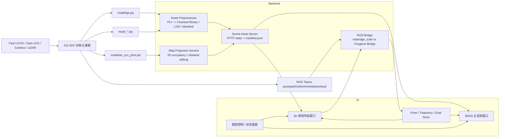

# GS-SDF 交互式建图与导航 UI 架构

## 先回答你的问题

可以直接复用已有 `GS-SDF` 目录，但不建议把整个训练仓库原样拷进你的前端项目。

更合理的做法是把现有 `GS-SDF` 当成 **地图生产端**，把你的新 UI 当成 **地图消费端**：

- 复用 `output/<scene>/model/gs.ply` 作为高保真视觉层
- 复用 `output/<scene>/model/as_occ_prior.ply` 作为 2D 占据投影的快速输入
- 复用 `mesh_*.ply` 作为物理碰撞层或导航可视化层
- 复用 ROS topics：`pose`、`path`、`odom`、`mesh`、`mesh_color`、`pointcloud`、`rgb`、`depth`
- 不要把 `submodules/`、`build/`、ROS catkin 结构直接塞进 Web UI 仓库

原因很直接：

- 现有 GS-SDF 是 ROS/C++ 训练与 RViz 可视化工程，不是浏览器友好的场景服务
- `gs.ply` 在真实场景里通常很大，当前机器上的样例已经达到 `687 MB` 和 `990 MB`
- 浏览器直接主线程解析大体积 PLY，会卡在 IO、解析、排序和显存上传

结论是：

- **能拷，但应该按“产物拷贝”而不是“整仓拷贝”来复用**
- 最好抽一层 `scene manifest + asset preprocessor + ros ws bridge`

## 推荐系统架构



## 分层职责

### 1. GS-SDF 保留为重建后端

职责：

- 输入 ROS bag、Fast-LIVO/Fast-LIO2 对齐后的图像与点云
- 训练 GS + Neural SDF
- 导出 `gs.ply`、`as_occ_prior.ply`、`mesh_*.ply`
- 在运行态发布机器人 pose、path、mesh、pointcloud

### 2. Asset Preprocessor

职责：

- 把 `gs.ply` 转成浏览器更友好的 chunked binary
- 预生成 LOD 和 chunk 索引
- 预生成 `scene.manifest.json`
- 可选把 mesh 转成 `glb`

建议输出结构：

```text
scene-pack/
  manifest.json
  gaussian/
    chunk_000.bin
    chunk_001.bin
    ...
  mesh/
    collision.glb
  map/
    occupancy.bin
    occupancy.meta.json
```

### 3. 前端 UI

推荐栈：

- React + TypeScript + Zustand
- 3D 图层：Three.js 负责 mesh、trajectory、robot、pointcloud overlay
- 3DGS 主渲染：优先 WebGPU，自定义 renderer；WebGL2 作为 fallback
- 2D 导航窗：Canvas2D 或 WebGL tile renderer

### 4. ROS 通信桥

ROS1：

- `rosbridge_suite`
- 前端用 `roslibjs`

ROS2/Nav2：

- 桌面端优先 `foxglove_bridge`
- 如果必须走 `rosbridge_suite`，建议单独写一个 goal adapter，把 `/move_base_simple/goal` 转换为 Nav2 `NavigateToPose`

## UI 视窗设计

### 主视觉窗口

职责：

- 专门渲染 GS-SDF 导出的 Gaussian splats
- 叠加 robot pose、trajectory、waypoints、碰撞 mesh
- 提供两种交互模式

推荐交互：

- 左键拖拽：平移，沿地平面平移 target
- 滚轮：指数缩放，不用线性 zoom
- 右键拖拽：yaw/pitch 旋转
- 双击：将 target 锁到当前点击处

这比纯 FPS 更适合“地图 App 式”操作，同时还能保留沉浸式漫游。

### 俯视导航窗口

职责：

- 渲染 occupancy grid
- 点击生成 waypoint/nav goal
- 框选区域生成虚拟障碍物
- 同步显示机器人 footprint、朝向、历史轨迹

地图源优先级：

1. `as_occ_prior.ply`
2. SDF mesh 投影
3. raw lidar point cloud 投影

### 数据控制面板

至少支持：

- Gaussian on/off
- SDF mesh on/off
- Raw LiDAR on/off
- Trajectory on/off
- Goals / Virtual Obstacles on/off
- Semantic layer placeholder

## 统一坐标约定

必须统一在同一世界系下工作，建议全部落到 `map` 或 GS-SDF 当前 `world` 系。

统一规则：

- `gs.ply`、`as_occ_prior.ply`、mesh、trajectory、navigation goal 都使用同一世界坐标
- 2D 地图只是在这个世界系上做俯视投影
- 从 2D 点击回推 goal 时，不允许再走另一套局部坐标系

如果底层导航跑的是 `map`，而 GS-SDF 发布的是 `world`，就加一层静态变换：

```text
T_map_world
```

所有 UI 层都消费同一份变换，避免 3D 和 2D 各算一套。

## Scene Manifest 建议

```json
{
  "sceneId": "campus_001",
  "frameId": "map",
  "gaussian": {
    "format": "gs-chunks",
    "chunks": ["/assets/campus_001/gaussian/chunk_000.bin"],
    "shDegree": 3
  },
  "occupancy": {
    "source": "as_occ_prior",
    "url": "/assets/campus_001/map/occupancy.bin",
    "resolution": 0.05,
    "origin": { "x": -40.0, "y": -35.0 }
  },
  "mesh": {
    "format": "glb",
    "url": "/assets/campus_001/mesh/collision.glb"
  },
  "robot": {
    "radius": 0.28,
    "height": 0.45
  }
}
```

## 3DGS 接入与 2D 同步核心逻辑

### 主流程

```text
1. 载入 scene manifest
2. 加载 gaussian chunks 与 mesh
3. 载入 occupancy grid 或从 as_occ_prior.ply 在线投影
4. 订阅 /tf、/odom、/path
5. 用同一世界系更新：
   - 3D robot pose
   - 3D trajectory
   - 2D footprint
   - 2D heading arrow
6. 在 2D 点击 goal，转换到 world/map，再发布 ROS
```

### 3DGS 渲染伪代码

```ts
async function bootstrapScene(manifestUrl: string) {
  const manifest = await fetchManifest(manifestUrl);

  const gaussianData = await gaussianLoader.load(manifest.gaussian);
  gaussianRenderer.initialize(canvas3d, {
    shDegree: manifest.gaussian.shDegree,
    frameId: manifest.frameId
  });
  gaussianRenderer.setScene(gaussianData);

  if (manifest.mesh) {
    const mesh = await meshLoader.load(manifest.mesh.url);
    overlayScene.add(mesh);
  }

  const occupancy = manifest.occupancy.url
    ? await occupancyLoader.load(manifest.occupancy)
    : await projector.projectOccPrior(manifest);

  nav2d.setGrid(occupancy);

  rosBridge.subscribePose((pose) => {
    state.robotPose = pose;
    gaussianRenderer.setRobotPose(pose);
    nav2d.setRobotPose(projectToGround(pose));
  });

  rosBridge.subscribePath((path) => {
    overlayScene.setTrajectory(path);
    nav2d.setTrajectory(projectPathToGround(path));
  });
}

function renderFrame(camera: CameraState) {
  const visibleChunks = culler.query(camera.frustum);
  const visibleSplats = depthSorter.sortApprox(visibleChunks, camera);

  gaussianRenderer.updateCamera(camera);
  gaussianRenderer.draw(visibleSplats);
  overlayRenderer.draw();
}
```

### 2D Occupancy 同步伪代码

```ts
function projectPathToGround(path3d: Pose3D[]): Pose2D[] {
  return path3d.map((pose) => ({
    x: pose.position.x,
    y: pose.position.y,
    yaw: quaternionToYaw(pose.orientation)
  }));
}

function buildGridFromOccPrior(points: Vec3[], res: number): OccupancyGrid {
  const grid = allocGridFromBounds(points, res);

  for (const p of points) {
    if (p.z < robotBaseMinZ || p.z > robotBodyMaxZ) {
      continue;
    }
    const cell = worldToCell(grid, p.x, p.y);
    grid[cell] = OCCUPIED;
  }

  dilateByRobotRadius(grid, robotRadius, res);
  return grid;
}
```

## 点击 2D 地图发布导航目标

坐标转换链路：

```text
screen pixel
-> map viewport local pixel
-> occupancy pixel
-> world/map metric coordinate
-> geometry_msgs/PoseStamped
-> /move_base_simple/goal
```

关键点：

- 先反算 viewport 的 pan/zoom 仿射变换
- 再乘 `resolution`
- 再加 `origin`
- Y 轴通常要翻转一次，因为图像坐标向下，地图坐标向上

## 性能瓶颈与优化建议

### 1. 大规模 Gaussian 的加载与解析

瓶颈：

- 单个 `gs.ply` 往往几百 MB
- 浏览器主线程解析 PLY header 和 property buffer 成本高
- 首帧等待长

优化：

- 预处理为 chunked binary，不要在线直接解析大 PLY
- 使用 Web Worker/OffscreenCanvas
- 首屏只加载 coarse LOD
- 按视锥与距离渐进加载

### 2. Splats 深度排序

瓶颈：

- 全量逐帧排序是 O(N log N)
- N 上百万时会直接爆主线程或 GPU 上传带宽

优化：

- chunk 级排序 + chunk 内近似排序
- 只对 visible chunk 排序
- 相机变化较小时复用上一帧排序
- 采用 tile-based bins 或 radix sort on GPU

### 3. 显存与带宽

瓶颈：

- position/scale/quat/opacity/SH 全量上传很重
- SH degree 越高，buffer 越大

优化：

- 远景降低 SH degree 或直接退化为 RGB
- 使用 `float16` 或量化编码
- 按 chunk 维护 GPU resident cache
- mesh/pointcloud overlay 与 gaussian pass 分开管理

### 4. 2D 投影实时更新

瓶颈：

- 每帧从 3D 点/mesh 重新投影到 2D 代价高

优化：

- 静态地图离线投影
- 仅把“虚拟障碍物”和“实时机器人 footprint”作为动态 overlay
- 使用 tile dirty-rect 更新，不全图重算

### 5. 拖页平移手感

常见问题：

- 3D 视图拖拽时会出现深度漂移
- 缩放时 target 飘移，导致用户失去参照

优化：

- 平移固定投影到地面平面 `z = ground_z`
- 缩放围绕鼠标命中的地面点做 zoom-to-cursor
- 相机状态用阻尼插值，不直接跳

## 实施建议

推荐拆成三个工程：

1. `gs-sdf-runtime`
   负责训练、导出、ROS 发布
2. `gs-sdf-asset-preprocessor`
   负责 `gs.ply -> chunk/LOD/manifest`
3. `gs-sdf-ui`
   负责 Web/Electron 多窗口 UI、交互和导航桥接

如果你现在想最快起步，不要先重构 GS-SDF 主仓库，先这样做：

1. 直接复用现有 `output/<scene>/model/gs.ply`
2. 直接复用现有 `output/<scene>/model/as_occ_prior.ply`
3. 做一个独立的 `scene.manifest.json`
4. 前端先接 `rosbridge_suite`
5. 先跑通 3D 看图、2D goal、pose/trajectory overlay
6. 最后再做语义后处理和在线编辑
