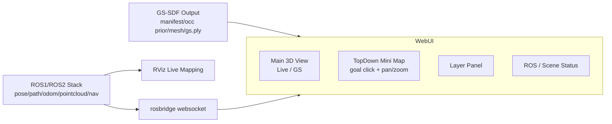
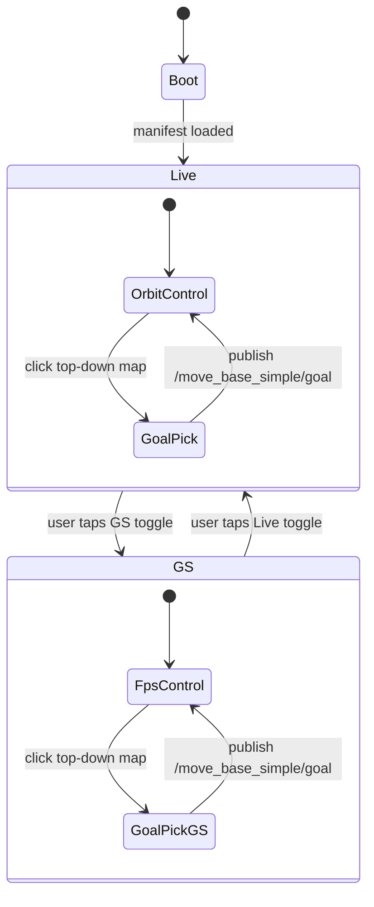

# Live / GS Console

## 目标

把界面拆成两个模式，而不是两套系统：

- `Live` 模式：承担 RViz 职责，看实时 tracking、mapping、点云、轨迹和机器人状态
- `GS` 模式：承担高保真浏览与交互测试，切到 3DGS/SDF 图层并启用 FPS 漫游

## UI 结构



## 模式说明

### Live 模式

- 主窗口优先看 `pointcloud + pose + path + odom`
- 相机控制是 `orbit + pan`
- 用来替代你现在最常用的 RViz 主视角
- 保持低负载、低延迟，便于观察 tracking 是否稳定

### GS 模式

- 主窗口切成 `gaussian + sdf mesh + robot overlay`
- 相机控制切成 `FPS`
- 键位建议：
  - `W/S`: 前后
  - `A/D`: 左右平移
  - `Q/E`: 上下
  - `Shift`: 加速
  - 鼠标：视角旋转
- 右上角保留 top-down mini map，避免第一人称下迷失方位

## 状态机



## ROS 接口

当前训练容器已经发布：

- `/neural_mapping/pose`
- `/neural_mapping/path`
- `/neural_mapping/odom`
- `/neural_mapping/pointcloud`
- `/neural_mapping/rgb`
- `/neural_mapping/depth`

Web UI 通过 `rosbridge` 订阅这些 topic，并保持和 scene manifest 同步。

## 部署入口

- 构建 ROS 工具镜像：
  `/home/chatsign/gs-sdf/scripts/build_ros_tools_image.sh`
- 启动 rosbridge：
  `/home/chatsign/gs-sdf/scripts/launch_rosbridge_sidecar.sh`
- 启动 RViz：
  `/home/chatsign/gs-sdf/scripts/launch_rviz_sidecar.sh`
- 安装 Web UI 依赖：
  `/home/chatsign/gs-sdf/scripts/install_web_ui.sh`
- 启动 Web UI：
  `/home/chatsign/gs-sdf/scripts/launch_web_ui_dev.sh`

## 推荐启动顺序

```bash
bash /home/chatsign/gs-sdf/scripts/launch_rosbridge_sidecar.sh
bash /home/chatsign/gs-sdf/scripts/launch_web_ui_dev.sh 0.0.0.0 5173
```

如果当前机器有桌面会话，再额外启动：

```bash
export DISPLAY=:0
bash /home/chatsign/gs-sdf/scripts/launch_rviz_sidecar.sh
```

## 当前访问地址

- Web UI:
  `http://localhost:5173/`
- rosbridge:
  `ws://localhost:9090`
